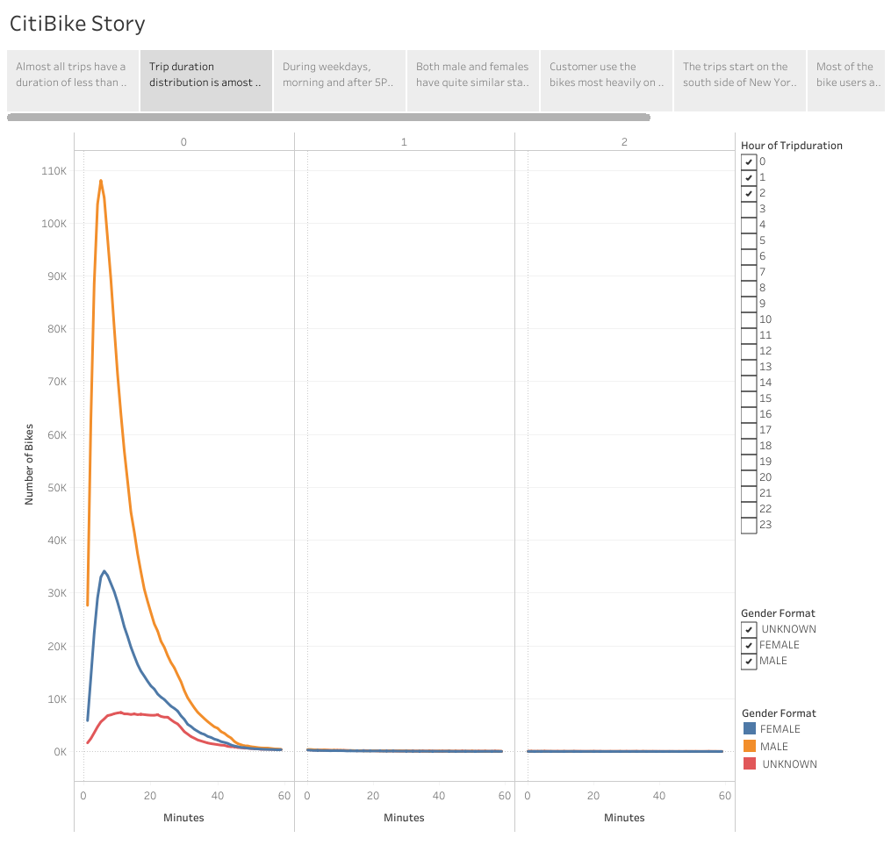

# CitiBike: Bike-Sharing Program

## Purpose

The purpose of this analysis is to convince investors that a bike-sharing program established in Des Moines could be quite beneficial financially. By using the data made available by Citi, we can interpolate the results and apply them to the city in Iowa.

The Tableau visualizations can be found in the following link: [CitiBike Visualizations](https://public.tableau.com/app/profile/rodrigo.valle/viz/Book2_16641346902030/CitiBikeStory?publish=yes)

## Results

This section will include a picture of all the visualizations as well as a description of its results:

- User Type

  - This one is quite straightforward. Out of all of the rides, the vast majority of people who uses the bikes have subscribed to the service. Only a small fraction is a customer.
    

- Start Location

  - The start location of trips is quite condensed into a small area of New York City, predominately in the South. In the outskirts of the city, there are scattered trips but are really minimal.
    

- Start and Stop Time by Gender

  - The heat map clearly indicates that there are many more males than females. Moreover, the start and stop days are quite similar for both even if the number of trips changes. Most usage happens in the morning, between 6am and 9am, and in the evening, between 5pm and 7pm. This indicates that the bikes are primarily used for commuting. Weekends also have some usage but no as heavy as weekdays do.
    

- Start and Stop Time

  - This is the same as the previous one with the caveat that it does not have a gender division. Since both genders have almost the exact same behavior in terms of the times, there is not much more that can be gained from this new visualization.
    

- Usage by Day, Gender, and User Type

  - The most important difference in the behavior of subscribers and customers is that subscribers use the bikes as a commute method while customers use it for leisure purposes on the weekends. As for the unknown gender, most are customers who act almost identical to males and females.
    

- Trip Duration

  - Most trips have a duration of less than 20 minutes. This goes along with the hypothesis that most users use the bikes for commuting. A leisure ride would most likely be longer than that.
    

- Trip Duration by Gender
  - This is similar to the previous one with the exception that trips are divided by gender. Both male and female have similar trip durations. On the other hand, the unknown gender has longer duration. It is important to note that most users with their gender as unknown are customers who use the bikes on a weekend. presumably for leisure.
    

## Results

The results indicate that most of the users have subscribed and could be considered business users since it is presumably used for commuting. There are leisure users on the weekends but do not account for as many as the business ones. Needless to say, the market in Des Moines is very different to the New York City one, which is why the users will behave differently.

Younger generations are using the service much more but are less prone to be subscribers than older ones. This is important to note since there is no recurring revenue in users that are just customers.

I would add the following two visualization in order to have a more thorough snapshot of the situation:

- Gender Distribution:

  - The following Image represents the gender distribution of all the trips that were made during the month of august. There are almost three times as many males as there are females. The average birth year of males is 1982 while it is 1983 for females. There are quite a few rides whose user identified as "Unknown". This is probably because users did not change the default gender and will be explained by one of the following visualizations.
    

- User Age and Type

  - The following graph divides users by gender and plots with different color depending on if the user has subscribed. There is clearly a problem with the "Unknown" gender information. Almost all the people who are identified as such where supposedly born in 1969. This means that the default for the app is that the gender is set as "Unknown" and the birth year set as 1969. For male and females there is a sharp upturn in number of trips for the millennials. It is worth noting that even though they do more trips, the subscriber/customer ratio is lower than for older people.
    
